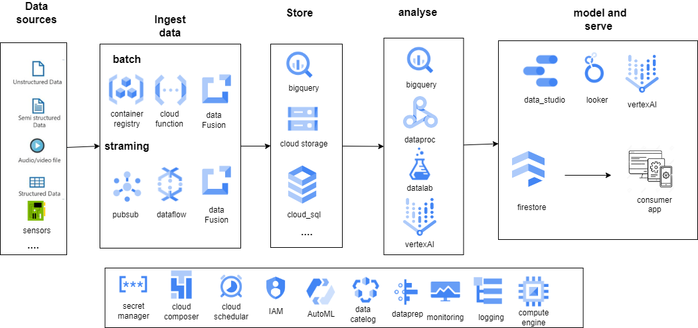

# professional Google Data Engineer Cloud Certification (GCP)
first we will take a look at general view for architecture of google cloud platform services for data engineer

1- **datasources** : can be any data source like (csv, json, database,sensors etc..)

2- **ingest data**
we can ingest data in 2 ways :
* **batch processing** : process data in batches (periodically)
deploying python code using *cloud functions* (serveless) or *compute engine* (VM) , *container registry* (docker) or *app engine* (PaaS). for big data (*dataproc,dataflow*)

* **streaming data**: process data in real time (continuously)
*pub/sub* is a messaging service that can be used to send data from one service to another. (like kafka)
dataflow is a managed service for processing data in batches and streams with apache beam. google provides also templates for dataflow. (like from pub/sub to bigquery)

* you can use *datafusion* (ETL) visual tool for process both batch and stream data.

3- **sink** : can be any data sink like (database, bigquery, cloud storage(data lake) etc..)

4- **process data** 

**bigquery** serverless data warehouse that supports SQL queries and real-time streaming data,ML,use it in jupyter notebook on vertex AI.  
note : 
it is very important to optimize your queries in bigquery (like partitioning, clustering, denormalization, flattening, using cache, using BI tools like datastudio, using BI engine, using bigquery ML, using bigquery)  

dataproc is a managed service for running Apache Spark and Apache Hadoop cluster.(distribued, big data)  

datalab is a jupyter notebook that can be used to run python code and queries on bigquery.  
vertex AI is a unified AI platform that allows you to build, deploy, and manage machine learning models.  

AutoML allows you to automate the process of training and deploying machine learning models.  

dataprep allows you to visually explore, clean, and prepare data for analysis and machine learning.  

5- **serve** : can be any service like (web app, BI tools, ML models,spreadsheet etc..)

6- **orchestration** : can be any orchestration tool like (cloud composer, cloud scheduler, cloud functions etc..)

7- **monitoring** : can be any monitoring tool like (cloud monitoring, cloud logging etc..)

8- **security** : can be any security tool like (IAM, secret manager etc..)

|service|role|description|
|---|---|---|
|pub/sub|streaming|fully managed messaging service that allows you to send and receive messages between independent applications. |
|dataflow|processing|fully managed service for executing Apache Beam pipelines. It allows you to build and run batch and streaming data processing pipelines with minimal latency, autoscaling|
|datapro|processing|fully managed service for running Apache Spark and Apache Hadoop cluster|
|datafusion|processing|ETL visual tool for process both batch and stream data|
|compute engine|compute|VM|
|cloud functions|compute| serveless event-driven functions (upload new file,timmer, http trigger)|
|kubernetes engine|compute|container orchestration,GKE allows you to run containers on a cluster of virtual machines, providing a scalable and flexible computing environment.|
|cloud storage|storage|scalable object storage service that allows you to store and retrieve any amount of data from anywhere|
|cloud sql|storage|fully managed relational database service that supports MySQL, PostgreSQL, and SQL Server|
|cloud firestore|storage|fully managed NoSQL document database|
|cloud spanner|storage|globally distributed relational database service|
|cloud bigtable|storage|scalable NoSQL wide-column database service|
|cloud bigquery|storage,compute,dwh,ML|serverless data warehouse that supports SQL queries and real-time streaming data,ML|
|data studio / looker|BI/serve|visualize data|
|vertex AI|ML/serve|unified AI platform that allows you to build, deploy, and manage machine learning models|
|cloud composer|orchestration|fully managed workflow orchestration service that allows you to create, schedule, monitor, and manage workflows|
|cloud scheduler|orchestration|fully managed cron job service that allows you to schedule jobs that run on specific intervals|
|secret manager|security|fully managed service that allows you to store and manage sensitive data|
|container registry|compute|private container image registry that allows you to store and manage Docker container images|
|IAM|security|Identity and Access Management |
|AutoML|ML|automate the process of training and deploying machine learning models|
|AI platform|ML|allows you to build, deploy, and manage machine learning models|
|data Catalog|metadata|allows you to discover, manage, and understand your data in Google Cloud|
|dataprep|processing|allows you to visually explore, clean, and prepare data for analysis and machine learning|
|cloud monitoring|monitoring|allows you to monitor the performance and availability of your cloud-powered applications|
|cloud logging|monitoring|allows you to store, search, analyze, monitor, and alert on log data and events from Google Cloud |

projects 
| project name | path | technologies | description |
| ------------ | ---- | ------------ | ----------- |
|  1_Creating a Streaming Data Pipeline for a Real-Time Dashboard with Dataflow            |streamingdata/ streamingDatapipelines      | bigquery,pubsub,dataflow template ,data studio             |   streaming data pipeline to   capture taxi revenue, passenger count, ride status, (pub/sub to bigquery using dataflow template) then explore data and visualize the results          |
|2_Predicting Visitor Purchases with a Classification Model with BigQuery ML| BigQuery/ predictingVistorPurchases| bigquery , bigquery ML | explore data analysis , create classification model and train/evaluate it then  improve performance using feature enginnering and prediction|
|3_Vertex AI Predicting Loan Risk with AutoML| Vertex_AI_Predicting Loan Risk ..| Vertex AI ,AutoML | upload data, train  with AutoML,evaluate and deploy model to endpoint|
|4_Using BigQuery to do Analysis| BigQuery/Analytics| BigQuery | load data from public datasets and explore data analysis|
|5_Loading Taxi Data into Google Cloud SQL| Cloud_SQL/ loaddatatocloudsql| Cloud SQL | create sql instance, whitelist IP ,create schema , add data (csv) to database|
|6_Loading Data,Array and structures in BigQuery| BigQuery/ workingWithJsonAndArrayData | BigQuery | deal with arrays,json,structs|
|7_Running Apache Spark jobs on Dataproc| Dataproc/sparktobg | Dataproc ,cloud storage ,bigquery | create dataproc cluster, run spark job, run spark job with jupyter notebook ,data from HDFS ,GCS,automate process,cloud function to process data and save result when upload data to GCS|
|8_Simple Dataflow , map reduce in dataflow| Dataflow/.. | Dataflow | create dataflow pipeline run locally/oncloud , map reduce in dataflow ,practicing pipeline side Inputs|
|9_Building and executing a pipeline in google cloud fusion| Datafusion/.. | Datafusion | wrangler ,create datafusion pipeline , run pipeline |
|10_Cloud Composer| cloudComposer/.. | Composer | create composer environment , create dag (create datapro cluster,run spark job,delete cluster) , create variables , monitor job|
|11_Streaming Data Processing Publish Streaming Data into PubSub| StreamingDataProcessing/ publish streaming data into pub sub | PubSub | create pub/sub topic , create subscription ,simulate sensors real time |
|12_Streaming Data Pipelines| StreamingDataProcessing/ streamingDataPipelines_2| PubSub ,dataflow| create pub/sub topic , impact increasing throughput , explore metrics , create Alerts|
|13_Streaming Data Processing Streaming Analytics and Dashboards| StreamingDataProcessing/ streamingAnalytics|data studio| create data studio dashboard|
|14_Streaming Data Processing Streaming Data Pipelines into Bigtable| StreamingDataProcessing/ Bigtable| bigtable ,dataflow ,pubsub| create bigtable instance , from pub/sub to bigtable , query |
|15_cloud_function_to_ingest-data|FunctionClouddemo| cloud function ,datalake ,cloud scheduler,database| create cloud function that run daily to ingest data from GCS to postgres database , accessing to your sensitive data using secret manager|
|16_Optimizing your BigQuery| BigQuery/ optimizingBigQuery| BigQuery | optimize queries in bigquery (like partitioning, minimize I/o, denormalization, reduce expensive computations , using cache,data skew overwhelming a worker , approximate aggregation functions)|
|17_Text classification with Cloud Natural Language API |AI/TextClassification| Cloud Natural Language API | AI,AIM ,bigquery  | classify text ,classify large dataset python code access to GCS make processing(classification) store result in bigquery|
|18_BigQuery in jupiter on vertex AI| BigQuery/ run_bq_on_vertex_AI| BigQuery ,vertex_AI | create jupyter notebook on vertex AI , run queries on bigquery , run python code on bigquery|
|19_ML pipeline on kubeflow | AI/MLPipelineonKubeflow| Kubeflow ,AI | create kubeflow xgboost pipeline , train/evaluate , deploy , predict |
|20_Predict Bike Trip Duration with a Regression Model in BQML| BigQuery/ regression_in_bqml| BigQuery ,BQML | create regression model , train/evaluate , predict ,feature engineering ,transform|
|21_Movie Recommendations in BigQuery ML| BigQuery/ Recommendation system | BigQuery ,recommendation sysem  | create recommendation model ,evaluate ,predict movies for user , targeting movie for users , perform batch prediction |
|22_sending email with container registry | containerRegistry/ | container registry ,set gmail password app  | create container that send email every minute, create container image , push image to container registry ,deploy it |
